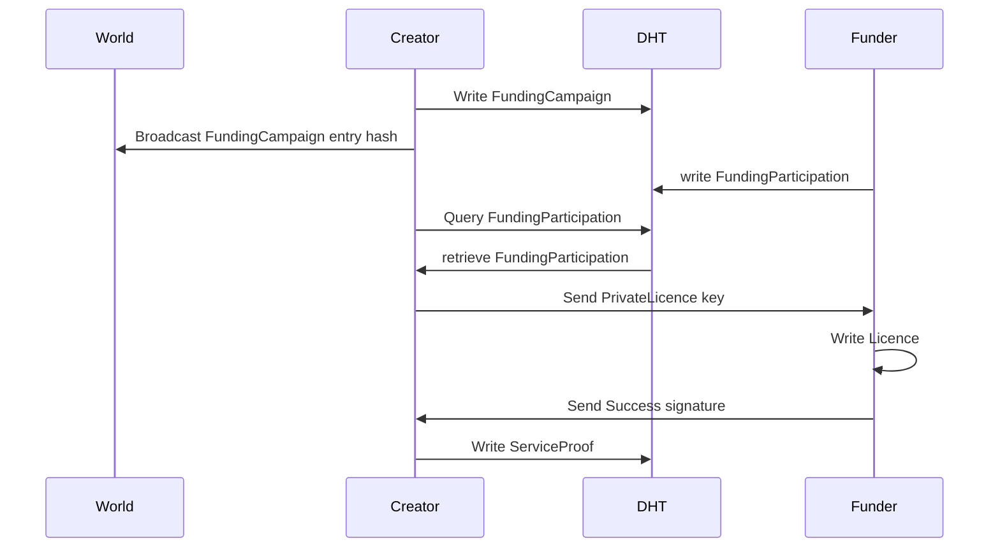
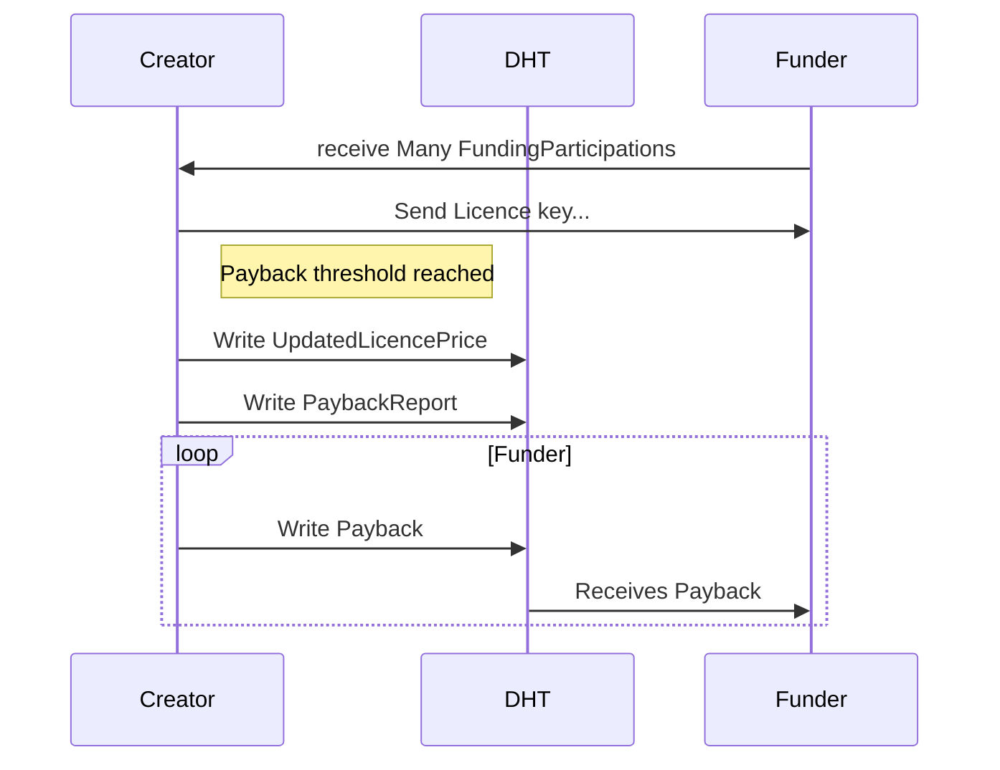

# FairFunding Workflow

### Start

```mermaid
sequenceDiagram
    participant World
    participant Creator
    participant DHT
    participant Funder
    Creator->>DHT: Write FundingCampaign
    Creator->>World: Broadcast FundingCampaign entry hash
    Funder->>DHT: write FundingParticipation
    Creator->>DHT: Query FundingParticipation
    DHT->>Creator: retrieve FundingParticipation
    Creator->>Funder: Send PrivateLicence key    
    Funder->>Funder: Write Licence
    Funder->>Creator: Send Success signature    
    Creator->>DHT: Write ServiceProof
```

### After Breakeven reached
    

```mermaid
sequenceDiagram
    participant Creator
    participant DHT
    participant Funder
    Funder->>Creator: receive Many FundingParticipations
    Creator->>Funder: Send Licence key...
    Note left of DHT: Payback threshold reached
    Creator->>DHT: Write UpdatedLicencePrice   
    Creator->>DHT: Write PaybackReport
    loop Funder
        Creator->>DHT: Write Payback
        DHT->>Funder: Receives Payback
    end
```